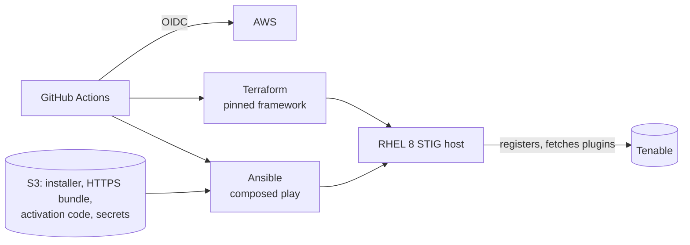

# nessus

[](https://github.com/nwarila-platform/nessus/actions/workflows/quality.yml)
[](https://github.com/nwarila-platform/nessus/actions/workflows/aws-deploy.yml)

This repository automates a **Tenable Nessus** vulnerability scanner on a STIG-hardened RHEL 8
host in an ephemeral AWS environment. Terraform provisions the CIS RHEL 8 STIG image. Ansible then:
- resolves the image account;
- bootstraps the Python its modules need;
- installs the pinned, digest- and signature-verified Nessus RPM;
- imports an HTTPS certificate the deployment owns;
- registers the scanner and fetches its plugins;
- converges its one administrator account.

GitHub Actions proves the result over HTTPS validated against the declared CA and hostname, proves
a second converge changes nothing, and destroys the environment.

At execution time the `nessus_scanner` role overlays onto a version-pinned
[`ansible-framework`](https://github.com/nwarila-platform/ansible-framework) checkout. That
checkout supplies `credential_resolver`, `host_readiness` and `os_bootstrap`, the generic role
loader, `ansible.cfg` and the lint configuration. This repository follows the fleet's reference
repository, [`pdq-deploy-inventory`](https://github.com/nwarila-platform/pdq-deploy-inventory):
same pins, workflows, toolchain and layout. It also carries the `dependencies/` declaration tree
that [`secure-wazuh`](https://github.com/nwarila-platform/secure-wazuh) introduced.

## What it demonstrates

- **A destroy-by-default lifecycle that proves itself.** Every run provisions, converges, converges
  again and must report no change, then destroys. See
  [`aws-deploy.yml`](.github/workflows/aws-deploy.yml).
- **HTTPS that is proven, not assumed.** The certificate is a password-protected PKCS#12 bundle
  this repository mints. The role decodes it with the host's FIPS-validated OpenSSL, checks it as a
  set, and imports it. The readiness wait then trusts *only* the declared CA and connects by the
  name the certificate carries, and the served leaf's fingerprint must equal the declared one.
- **Data that outlives the OS.** The scanner's whole install root — plugins, settings,
  certificates, accounts, scan data — is a standalone data volume. The OS disk is replaceable, and
  the pipeline proves the scanner resumes on its own database afterwards.
- **Written for a hardened host.** FIPS mode, fapolicyd, `noexec` temporary directories, enforced
  local-package signature checks and firewalld are all live on the target, and every step is
  shaped by them. See the [role README](ansible/applications/nessus_scanner/README.md).
- **No stored cloud keys.** GitHub OIDC only, gated to protected `main`, with a separate tag-scoped
  cleanup identity in [`aws-reaper.yml`](.github/workflows/aws-reaper.yml). The guest never
  receives cloud credentials: the controller fetches every object and hands it a verified copy.
- **Declared dependencies.** [`dependencies/`](dependencies/) records the IAM, artifacts and secrets
  the deployment depends on. A credential-free validator proves they are closed, tokenized, and in
  agreement with what the playbook consumes.



## How it runs

The `aws-deploy` workflow owns the lifecycle:
1. Terraform provisions the host and its data volume, from the newest preserved snapshot when
   there is one.
2. The composed [`nessus-aws.yml`](ansible/playbooks/nessus-aws.yml) play converges it.
3. An **idempotency gate** proves a second converge reports `changed=0`.
4. Terraform destroys the host.

A push to `main` that touches a deploy input proves it immediately, and a weekly schedule proves
it recurs. `workflow_dispatch` adds six inputs:
- `hold_minutes` keeps the scanner up for interactive work;
- `os_swap` replaces the OS drive and proves the scanner resumes on its data volume (below);
- `preserve_data` preserves this run's data disk for the runs after it (below);
- `fresh_data` ignores preserved disks and proves the from-scratch install;
- `absent_proof` proves `state=absent` removes it idempotently;
- `skip_products` builds the host alone.

A held scanner is reachable from the operator address the `AWS_DEBUG_HOSTNAME` secret names:

```bash
ssh -L 8834:localhost:8834 ec2-user@<public IPv4>
# then browse https://localhost:8834, trusting the CA from scripts/mint-nessus-https.sh
```

Locally, `scripts/compose-and-run.sh` builds the same composed tree and runs the play, and
`scripts/converge-held-bed.sh` converges a bed a workflow run is holding.

## OS-drive replacement

`/opt/nessus` is a standalone EBS volume, tagged `Function=NESSUS`, and independent of the OS disk.
Tenable's supported way to move a scanner's data is to move `/opt/nessus` whole, so that is the
unit. The framework's `linux_disk_manager` resolves the volume by that tag, never by device name.
It partitions, formats and mounts a blank volume, and adopts an already-labelled one without
reformatting it.

Bumping the framework's `refresh_serial`, or dispatching `aws-deploy` with `os_swap=true`,
**replaces the OS instance in place while the same data volume detaches and re-attaches**. The
converge then:
- reinstalls the package over the preserved install root;
- keeps the settings, certificate and accounts it finds there;
- registers again only if Tenable's registration did not survive the new machine.

The opt-in proof writes a record into Nessus's database before the replacement and requires it to
read back afterwards. It then runs the same `changed=0` gate on the rebuilt host.

Tenable binds a registration to the machine, so the replacement registers again. With Nessus
Essentials, an OS-drive replacement therefore needs a fresh activation code (TD-007).

## Data preservation

A preserved data disk is **always used when one is available**. Every run creates its data volume
from the newest completed snapshot tagged `Preserve=true` for this repository, when one exists. The
converge then adopts a volume that already holds the scanner's settings, certificate, account,
plugins and scan results. With no preserved snapshot, or when a `fresh_data` dispatch asks for the
from-scratch proof, the run starts blank.

Whether a run's own disk is preserved is the `preserve_data` flag's decision. At teardown the
instance is stopped, which shuts Nessus down and unmounts the volume cleanly. The volume is then
snapshotted with the `Preserve=true` tag before it is destroyed. The two newest preserved snapshots
are kept, and the runner can delete only snapshots carrying those tags.

What carries over is everything Nessus stores. What does not is the registration: Tenable binds it
to the machine, so a preserved scanner on a new instance registers again (measured 2026-09-30).
Tenable documents an activation code as "a one-time code", and names Nessus Professional and
Expert as the editions whose code can be used on multiple systems; see TD-007.

## What must exist before a deploy

| Object | Where | Made by |
|---|---|---|
| Nessus RPM | `s3://<account-id>-apprepo/Tenable Inc/Nessus/<version>/Tenable-Inc_Nessus_<version>-el8_x64.rpm` | Tenable's download, verified against the pinned SHA-256 |
| HTTPS bundle and its password | `s3://<account-id>-ansible/applications/nessus/nessus-https.p12`, `…/nessus-https-p12-password.txt` | `scripts/mint-nessus-https.sh`; its digest is pinned in the playbook |
| Activation code | `s3://<account-id>-ansible/applications/nessus/activation-code.txt` | Tenable. A Nessus Essentials code registers exactly one scanner, so every deploy that registers a new scanner needs a fresh one |
| Administrator password | `s3://<account-id>-ansible/applications/nessus/administrator-password.txt` | One line, at least 12 characters |
| Runner read grant | `nwarila-platform_nessus_runner_s3` v2 | Applied 2026-09-30 from [`dependencies/aws/`](dependencies/) |

The `nwarila-platform_nessus_admin` role can write everything under
`applications/nessus/`.

## Layout

| Path | Purpose |
|---|---|
| `ansible/applications/nessus_scanner/` | The Nessus application role |
| `ansible/playbooks/nessus-aws.yml` | Composed play: inventory contract, credential resolution, readiness, bootstrap, then the scanner |
| `ansible/inventory/aws_ec2.yml` | Dynamic AWS inventory (filters this run's instance by tag) |
| `terraform/aws.tfvars` | Data-only input to the pinned aws-terraform-framework (no `.tf` files here) |
| `dependencies/` | The AWS estate, artifacts and secrets this repository depends on, validated by `scripts/check-dependencies.py` |
| `scripts/` | Composition, script materialization, the HTTPS minting script and the dependency validator |
| `docs/TECH-DEBT.md` | Current engineering debt |

## Status

**Deployed and proven through CI/CD on 2026-09-30.** AWS Deploy run
[36773018135](https://github.com/nwarila-platform/nessus/actions/runs/36773018135) ran green end
to end with no manual intervention, on the CIS RHEL 8 STIG image. In that run:
- `/opt/nessus` was provisioned on its own data volume;
- the pinned Nessus 10.12.4 was installed, registered and reached `ready` over HTTPS validated
  against the declared CA and hostname;
- the administrator account was proven by signing in;
- a second converge reported `changed=0`;
- the data volume was preserved as a snapshot, and the environment was destroyed.

**Data preservation is proven on a new machine.** Run
[36779428440](https://github.com/nwarila-platform/nessus/actions/runs/36779428440) seeded a new
instance's data volume from that snapshot. The disk was adopted without formatting, and the
package was reinstalled. The settings, certificate and account were found intact, with nothing
rewritten, re-imported or re-created.

**Tenable's registration does not move with the data.** On a new machine the preserved scanner
reports itself unregistered and must register again. That run's registration was refused because
the Essentials code in S3 had already been spent (TD-007). So every new machine — every run, and
every OS-drive replacement — needs a fresh Essentials code, or a licence whose code re-registers.
