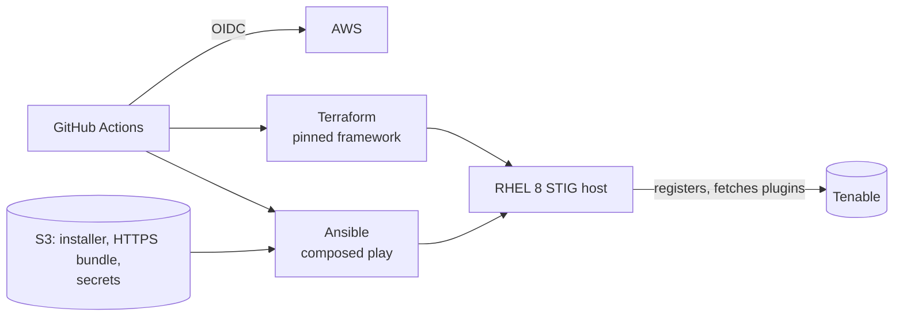

# nessus

[](https://github.com/nwarila-platform/nessus/actions/workflows/quality.yml)
[](https://github.com/nwarila-platform/nessus/actions/workflows/aws-deploy.yml)

This repository automates a **Tenable Nessus** vulnerability scanner on a STIG-hardened RHEL 8
host in an ephemeral AWS environment. Terraform provisions the CIS RHEL 8 STIG image. Ansible then:
- resolves the image account;
- bootstraps the Python its modules need;
- installs the pinned, digest- and signature-verified Nessus RPM;
- imports an HTTPS certificate the deployment owns;
- registers the scanner and fetches its plugins;
- converges its one administrator account.

GitHub Actions proves the result over HTTPS validated against the declared CA and hostname, proves
a second converge changes nothing, and destroys the environment.

At execution time the `nessus_scanner` role overlays onto a version-pinned
[`ansible-framework`](https://github.com/nwarila-platform/ansible-framework) checkout. That
checkout supplies `credential_resolver`, `host_readiness` and `os_bootstrap`, the generic role
loader, `ansible.cfg` and the lint configuration. This repository follows the fleet's reference
repository, [`pdq-deploy-inventory`](https://github.com/nwarila-platform/pdq-deploy-inventory):
same pins, workflows, toolchain and layout. It also carries the `dependencies/` declaration tree
that [`secure-wazuh`](https://github.com/nwarila-platform/secure-wazuh) introduced.

## What it demonstrates

- **A destroy-by-default lifecycle that proves itself.** Every run provisions, converges, converges
  again and must report no change, then destroys. See
  [`aws-deploy.yml`](.github/workflows/aws-deploy.yml).
- **HTTPS that is proven, not assumed.** The certificate is a password-protected PKCS#12 bundle
  this repository mints. The role decodes it with the host's FIPS-validated OpenSSL, checks it as a
  set, and imports it. The readiness wait then trusts *only* the declared CA and connects by the
  name the certificate carries, and the served leaf's fingerprint must equal the declared one.
- **Every setting under configuration management.** All 160 settings Nessus 10.12.4 has are
  declared in the repository, hardened to common STIG controls (TLS 1.3 only, FIPS enforcing,
  lockout, 15-character complex passwords, idle timeout) and otherwise at the product's value.
  Every converge converges all of them and refuses a misspelled name, so any setting changes
  through a pull request. See the role README's
  [Settings](ansible/applications/nessus_scanner/README.md#settings).
- **Data that outlives the OS.** The scanner's whole install root — plugins, settings,
  certificates, accounts, scan data — is a standalone data volume. The OS disk is replaceable, and
  the pipeline proves the scanner resumes on its own database afterwards.
- **Written for a hardened host.** FIPS mode, fapolicyd, `noexec` temporary directories, enforced
  local-package signature checks and a default-drop nftables firewall are all live on the target, and every step is
  shaped by them. See the [role README](ansible/applications/nessus_scanner/README.md).
- **No stored cloud keys.** GitHub OIDC only, gated to protected `main`, with a separate tag-scoped
  cleanup identity in [`aws-reaper.yml`](.github/workflows/aws-reaper.yml). The guest never
  receives cloud credentials: the controller fetches every object and hands it a verified copy.
- **Declared dependencies.** [`dependencies/`](dependencies/) records the IAM, artifacts and secrets
  the deployment depends on. A credential-free validator proves they are closed, tokenized, and in
  agreement with what the playbook consumes.



## How it runs

The `aws-deploy` workflow owns the lifecycle:
1. Terraform provisions the host.
2. The composed [`nessus-aws.yml`](ansible/playbooks/nessus-aws.yml) play converges it.
3. An **idempotency gate** proves a second converge reports `changed=0`.
4. Terraform destroys the host.

The deploy runs only when dispatched on `main`, because every run registers a new scanner and needs
a fresh activation code (TD-007). `workflow_dispatch` takes five inputs:
- `activation_code`, the fresh code, masked in the logs and never stored;
- `hold_minutes` keeps the scanner up for interactive work;
- `os_swap` replaces the OS drive and proves the scanner adopts its data volume (below);
- `absent_proof` proves `state=absent` removes it idempotently;
- `skip_products` builds the host alone.

A held scanner is reachable from the operator address the `AWS_DEBUG_HOSTNAME` secret names:

```bash
ssh -L 8834:localhost:8834 ec2-user@<public IPv4>
# then browse https://localhost:8834, trusting the CA from scripts/mint-nessus-https.sh
```

Locally, `scripts/compose-and-run.sh` builds the same composed tree and runs the play, and
`scripts/converge-held-bed.sh` converges a bed a workflow run is holding.

## The data volume: adopt what is there, otherwise install

`/opt/nessus` is a standalone EBS volume, tagged `Function=NESSUS`, and independent of the OS disk.
Tenable's supported way to move a scanner's data is to move `/opt/nessus` whole, so that is the
unit. The framework's `linux_disk_manager` resolves the volume by that tag, never by device name.
It partitions, formats and mounts a blank volume, and adopts an already-labelled one without
reformatting it.

The scanner role follows the same rule as the fleet's other applications, PDQ, WSUS and Wazuh:
**if the volume already holds a scanner, adopt it; otherwise install one.** A volume holds a
scanner when the installation's identity is there: its UUID and the key its stored secrets are
encrypted with. Adopting a scanner:
- reinstalls the package over it when this OS lacks the package, and requires the identity to come
  through that transaction byte for byte;
- keeps the settings, certificate and account it finds, and writes none of them;
- registers again, because Tenable binds a registration to the machine (TD-007).

Each run's volume is created blank and destroyed with its host, so an ordinary run installs. The
volume outlives the OS disk, not the run. Bumping the framework's `refresh_serial`, or
dispatching `aws-deploy` with `os_swap=true`, **replaces the OS instance in place while the same
data volume detaches and re-attaches**, and the converge adopts it. The opt-in proof writes a
record into Nessus's database before the replacement and requires it to read back afterwards. It
then runs the same `changed=0` gate on the rebuilt host. With Nessus Essentials, the replacement's
registration needs a fresh activation code (TD-007).

## What must exist before a deploy

| Object | Where | Made by |
|---|---|---|
| Nessus RPM | `s3://<account-id>-apprepo/Tenable Inc/Nessus/<version>/Tenable-Inc_Nessus_<version>-el8_x64.rpm` | Tenable's download, verified against the pinned SHA-256 |
| HTTPS bundle and its password | `s3://<account-id>-ansible/applications/nessus/nessus-https.p12`, `…/nessus-https-p12-password.txt` | `scripts/mint-nessus-https.sh`; its digest is pinned in the playbook |
| Activation code | Typed into the `activation_code` input at dispatch; never stored | Tenable. A Nessus Essentials code registers exactly one scanner, so every deploy that registers a new scanner needs a fresh one |
| Administrator password | `s3://<account-id>-ansible/applications/nessus/administrator-password.txt` | One line, at least 12 characters |
| Runner read grant | `nwarila-platform_nessus_runner_s3` v2 | Applied 2026-09-30 from [`dependencies/aws/`](dependencies/) |

The `nwarila-platform_nessus_admin` role can write everything under
`applications/nessus/`.

## Layout

| Path | Purpose |
|---|---|
| `ansible/applications/nessus_scanner/` | The Nessus application role |
| `ansible/playbooks/nessus-aws.yml` | Composed play: inventory contract, credential resolution, readiness, bootstrap, then the scanner |
| `ansible/inventory/aws_ec2.yml` | Dynamic AWS inventory (filters this run's instance by tag) |
| `terraform/aws.tfvars` | Data-only input to the pinned aws-terraform-framework (no `.tf` files here) |
| `dependencies/` | The AWS estate, artifacts and secrets this repository depends on, validated by `scripts/check-dependencies.py` |
| `scripts/` | Composition, script materialization, the HTTPS minting script and the dependency validator |
| `docs/TECH-DEBT.md` | Current engineering debt |

## Status

**Deployed and proven through CI/CD on 2026-09-30.** AWS Deploy run
[36773018135](https://github.com/nwarila-platform/nessus/actions/runs/36773018135) ran green end
to end with no manual intervention, on the CIS RHEL 8 STIG image. In that run:
- `/opt/nessus` was provisioned on its own data volume;
- the pinned Nessus 10.12.4 was installed, registered and reached `ready` over HTTPS validated
  against the declared CA and hostname;
- the administrator account was proven by signing in;
- a second converge reported `changed=0`;
- the environment was destroyed.

**Adoption is proven on a new machine.** Run
[36779428440](https://github.com/nwarila-platform/nessus/actions/runs/36779428440) gave a new
instance a data volume that already held that scanner, restored from a snapshot of it. The disk
was adopted without formatting, and the package was reinstalled. The settings, certificate and
account were found intact, with nothing rewritten, re-imported or re-created.

**Tenable's registration does not move with the data.** On a new machine the adopted scanner
reports itself unregistered and must register again. That run's registration was refused because
the Essentials code in S3 had already been spent (TD-007). So every new machine — every run, and
every OS-drive replacement — needs a fresh Essentials code, or a licence whose code re-registers.
